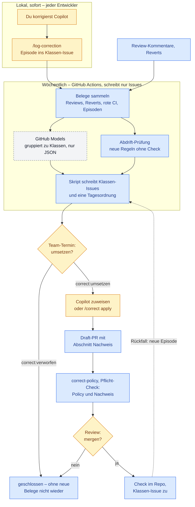
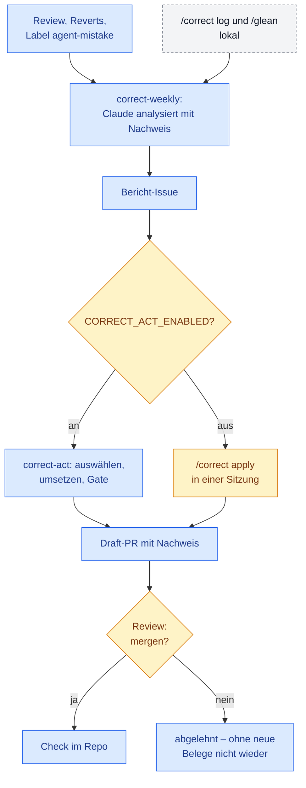

# correct-kit

**Korrigiere die Umgebung, nicht den Agenten.** Wenn ein KI-Agent denselben Fehler wiederholt,
bringt ihm das Repo diesen Fehler bei: ein Muster zum Kopieren, eine Regel nur als Prosa, ein
Check, den es nicht gibt. correct-kit macht daraus einen wöchentlichen Kreislauf: Fehler
belegen, zu Klassen bündeln, mit der stärksten möglichen Durchsetzung abstellen, als Draft-PR
vorlegen. Du mergst oder schließt.

Entstanden in [LernSnap](examples/lernsnap/) (Flutter), angelehnt an pstack von poteto.
Läuft mit **Claude Code** (vollautomatisch über GitHub Actions) oder mit **GitHub Copilot**
(Klassen-Issues automatisch, Entscheidung im Team, Umsetzung über den Copilot Coding Agent).

## Die Methode

**Die Leiter** — jede Fehlerklasse auf der höchsten Stufe beheben, die sie wirklich verhindert:

1. **Architektur** — der falsche Weg existiert nicht mehr (ein Ort, ein Modul)
2. **Typ** — der falsche Weg kompiliert nicht (privater Konstruktor, eigener Typ)
3. **Lint/CI** — ein Architekturtest oder eine Regel schlägt an, mit einer Meldung, die den richtigen Weg nennt
4. **Test** — Verhalten festgenagelt
5. **Doku** — nur für Ermessensfragen

**Nachweis** — ein Fix zählt erst, wenn der Check auf dem historischen Fehler **rot**, heute
**grün** und ohne **Fehlalarme** ist und in den Verify-Kommandos läuft (lokal und in CI dasselbe).
Dazu zwei, drei naheliegende Umgehungen rot machen, nicht nur den alten Diff.

**Prosa schrumpft** — erzwingt ein Check eine Regel, wird ihr Text in den Agenten-Anweisungen
zum Verweis; kann der Fehler gar nicht mehr passieren, fliegt die Regel aus der Tabelle.
Verbreitete Altfälle hält ein **Ratchet** (Baseline darf nur schrumpfen); **Ausnahmen** stehen an
der Zeile mit Grund, Ablaufdatum und Freigabe, und nur Menschen setzen sie.

**Belege statt Gefühl** — eine Klasse braucht mindestens zwei unabhängige Vorkommen:
Review-Kommentare, Reverts und Fix-ups, Korrektur-Issues (Label `agent-mistake`), lokale
Chatverläufe über `/glean`.

## Der Ablauf mit GitHub Copilot (Team-Triage)

Zwei Schleifen: **lokal und sofort** bei jedem Entwickler, **wöchentlich** als QS-Lauf über alle.
Das Team entscheidet einmal pro Woche, was umgesetzt wird; danach kommt jeder erst wieder beim PR dazu.



🟦 automatisch · 🟨 Mensch · ⬜ gestrichelt: optional (empfohlen)

| | Automatisch | Mensch | Optional |
|---|---|---|---|
| **Einmalig** | Setup-Agent: Bestandsaufnahme, Vertrag, Dateien, ein Draft-PR | Bestandsaufnahme und Vertrag bestätigen, Setup-PR mergen; Admin: Pflicht-Check, Coding Agent, erlaubte Actions | GitHub Models (`CORRECT_MODELS_ENABLED`), `CORRECT_REPORT_ASSIGNEE` |
| **Sofort** | – | `/log-correction` nach einer Korrektur | Label `agent-mistake` von Hand |
| **Wöchentlich** | Belege, Klassen-Issues (max. 3 neue), Tagesordnung, Rückfälle öffnen, Abdrift, ruhige Klassen schließen | Team-Termin: `correct:umsetzen` oder `correct:verworfen` | tiefere Analyse mit `/correct analyse` |
| **Umsetzung** | Coding Agent baut den PR; `correct-policy` prüft Policy und Nachweis | Issue an Copilot zuweisen (oder lokal `/correct apply`); ggf. „Approve and run workflows“ | `/architect` bei Schnittstellen |
| **Abschluss** | Merge schließt das Klassen-Issue | Review: mergen oder schließen | – |

Wie die Issues aussehen und wie viele es werden: [docs/issue-format.md](docs/issue-format.md).

## Der Ablauf mit Claude Code



| Wann | Baustein | Darf | Ergebnis |
|---|---|---|---|
| laufend | automatisches Review auf PRs | kommentieren | Befunde = wichtigste Belege |
| sofort | `/correct log` nach deiner Korrektur; lokal `/glean` | Issues | Episode im Klassen-Issue |
| wöchentlich | `correct-weekly` | nur lesen | **ein** Bericht-Issue: Klassen, neu / wiederkehrend / Rückfall, vorgeschlagene Ebene |
| danach | `correct-act` (Kill-Switch) | Draft-PR | Auswahl 🤖 auto / 👤 owner / ✖ skip als Kommentar; je 🤖-Klasse Umsetzung mit Nachweis, Gate, Draft-PR |
| du | mergen oder schließen | Freigabe | Merge = Freigabe; Schließen = abgelehnt |

## Konstruktionsregeln (teuer gelernt)

1. **Das Modell liest, der Workflow schreibt.** Issues, Pushes, PRs legt ein Workflow-Schritt ohne Modell an.
2. **Grenzen in Skript und Rechten, nicht im Prompt.** `correct_policy.sh` prüft Pfade, Größe, Tests, Muster der harten Regeln. Gate mit Lese-Token; Publish mit Schreibrechten, aber ohne Repo-Code. Das Policy-Skript liegt in `.github/` und ist damit selbst gesperrt.
3. **Jede Autonomiestufe hat Kill-Switch und Probezeit** (Repo-Variable; am Ende zählen: gemergt / verworfen / Fehlalarm).
4. **„Grün“ heißt nicht „geprüft“.** Jeder Lauf hat ein sichtbares Ergebnis oder ein Fallback-Issue.
5. **Headless-Fallen:** Unteragenten im Vordergrund (`CLAUDE_CODE_DISABLE_BACKGROUND_TASKS=1`, mit Wächter-Test); Werkzeug-Allowlist passend zum Kommando; geänderte Workflows wirken erst nach dem Merge.
6. **Tracker klein halten:** ein Issue pro Klasse, ein offener Bericht; Erledigtes schließt der Fix-PR per `Closes #n`.
7. **Erst nachsehen, dann anlegen:** bestehende ADRs, Glossar, Kontext und Agenten-Anweisungen werden erweitert, nicht dupliziert.

## Installation

### Claude Code

```text
/plugin marketplace add Kreatixly/correct-kit
/plugin install correct-kit@correct-kit
```

Dann im Ziel-Repo: **„Richte correct-kit ein“** (Skill `correct-setup`). Das Setup fragt zuerst
nach dem Ziel (Claude Code, GitHub Copilot oder beides), macht eine Bestandsaufnahme und legt
alles als **einen Draft-PR** an.

### GitHub Copilot (ohne Claude)

Repo klonen oder als Ordner neben das Ziel-Repo legen und im Copilot-Chat (Agent-Modus) im
Ziel-Repo ausführen:

```text
Lies <pfad-zu-correct-kit>/skills/correct-setup/SKILL.md und folge ihm. Ziel: GitHub Copilot.
```

Copilot-Dateinamen und -Funktionen (Prompt-Dateien, Coding Agent, GitHub Models) ändern sich
zwischen GitHub-Versionen; das Setup prüft sie gegen die aktuelle Doku deiner GitHub-Variante.

## Inhalt

| Pfad | Was |
|---|---|
| `skills/correct/` | `/correct` (Analyse), `/correct init`, `/correct apply <Klasse>`, `/correct log` |
| `skills/architect/` | Schnittstelle zuerst, agentenfreundliches Design |
| `skills/glean/` | Korrekturen aus lokalen Claude-Code-Chatverläufen (nur CLI, lokal) |
| `skills/correct-setup/` | Installation in ein Repo |
| `templates/contract.md` | Projektvertrag (alles Projektspezifische an einem Ort) |
| `templates/policy/` | `correct_policy.sh` + Konfiguration, `check_proof.sh` (Nachweis im PR) |
| `templates/claude/workflows/` | `correct-weekly`, `correct-act`, `claude-code-review` |
| `templates/copilot/` | Workflows, Prompt-Dateien, Instructions, `correct_issues.py` (Klassen-Issues und Tagesordnung) |
| `docs/issue-format.md` | Aufbau, Mengen und Lebenslauf der Issues, mit echten Beispielen |
| `templates/adr/`, `templates/docs/`, `templates/guards/` | Entscheidungs-, Doku- und Wächter-Vorlagen |
| `scripts/render.py` | füllt Platzhalter, verweigert halb gefüllte Dateien |
| `examples/lernsnap/` | vollständige Werte, Policy und Wächter-Test aus dem Ursprungsprojekt |
| `tests/` | `selftest.sh` (Render, YAML, Shell, Policy, Nachweis) und Tests für `correct_issues.py` |

## Was du selbst tun musst

- Claude: Secret `CLAUDE_CODE_OAUTH_TOKEN`; Actions-Einstellung „Allow GitHub Actions to create
  and approve pull requests“; Repo-Variable `CORRECT_ACT_ENABLED=true`, wenn Auto-PRs starten sollen.
- Copilot: `correct-policy` als Pflicht-Prüfung; Coding Agent aktiv, Workflows auf seinen PRs
  erlaubt; `CORRECT_MODELS_ENABLED=true` für GitHub Models (empfohlen, sonst entstehen neue
  Klassen nur aus `/log-correction`); ein fester Team-Termin pro Woche.
- Beide: optional `CORRECT_REPORT_ASSIGNEE` (Login), wenn Bericht-Issues zugewiesen werden sollen.
- Enterprise: Policies für Coding Agent, GitHub Models, erlaubte Actions und Runner liegen oft
  auf Enterprise- oder Org-Ebene; das Setup listet, was ein Admin freigeben muss.
- Nach dem Merge: `correct-weekly` einmal von Hand starten und den Bericht lesen.

## Grenzen

- Für GitHub gebaut (github.com inkl. GHE Cloud; GHE.com mit Prüfung im Setup; auf GHES fehlen
  nach heutigem Stand Coding Agent und GitHub Models).
- Toolchain-Setup und Wächter-Test werden pro Stack erzeugt; der erste Lauf in einem neuen
  Stack braucht einen Blick von dir.
- Copilot: Die Klassen des Wochenlaufs sind ein Entwurf von GitHub Models ohne Nachweis; der
  Nachweis kommt im PR. Die vollautomatische Stufe (Agent-Task wählt und setzt selbst um) ist als
  Stufe 2 in `templates/adr/team-triage.md` beschrieben, aber nicht eingebaut.
- Texte der Klassen-Issues und der Tagesordnung sind derzeit deutsch (`correct_issues.py`).
